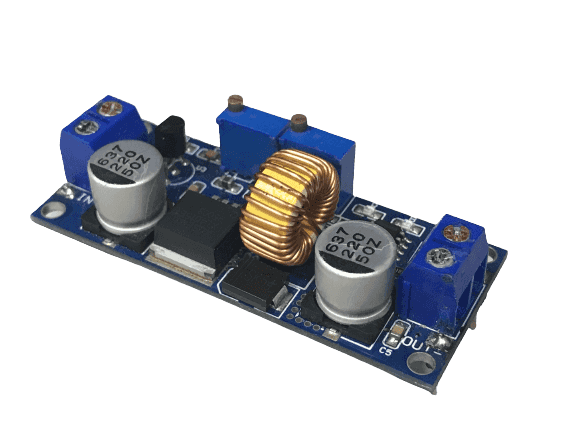

## 
Assembly Instructions & Diagrams(組裝說明與示意圖)
 

### 中文
**我們以樹莓派 Raspberry Pi 4開發版做為控制核心，接收Raspberry Pi Camera Moudule V2的影像，在進行影像辨識，進行閃躲紅綠色積木，並讀取D100 LiDAR、TCS34725 RGB，分別得知與圍牆的距離和測到場地上什麼顏色的線，再給予馬達數值，控制馬達的正反轉與轉速。**

### English
**We use Raspberry Pi 4 Development Board as the control core, which receives images from the Raspberry Pi Camera Module V2 for image recognition. The system will detect and avoid red and green color blocks while reading data from D100 LiDAR and TCS34725 RGB sensors. The LiDAR provides distance measurements to the surrounding walls, while the TCS34725 RGB sensor detects the color of the lines on the field. Based on this data, motor values are calculated to control the direction and speed of the motors.**

|Item Name|Item Photo|Function or Purpose(Chinese)|Function or Purpose(English)|
| :----:|:----:|:----|:----|
|JGA25-370 Motor||我們提供用於驅動機型的馬達。|We provide motors for driving the model.|
|MG90S Servo Motor||伺服馬達能夠有效改進機型的轉向表現。|The servo motor effectively improves the steering performance of the model.|
|L293D Quadruple Half-H Driver||用於控制JGA25-370馬達的轉速和轉向|It is used to control the speed and steering of the JGA25-370 motor.|
|TCS34725 RGB||用於偵測場地上的藍色和橘色線，助於判斷要順時針跑還是逆時針跑|It is used to detect blue and orange lines on the field, helping determine whether to run clockwise or counterclockwise.|
|Raspberry Pi 4||讀取各個感測器的數值和GPIO接腳給予馬達高、低電位，讓馬達可以正反轉|Read the values of various sensors and GPIO pins to provide the motor with high and low potentials, enabling forward and reverse rotation.|
|Sony IMX 219 鏡頭模組||用於辨識場地上的紅綠色積木，助於閃避障礙物|It is used to identify red and green blocks on the field, helping to avoid obstacles.|
|IMX219廣角160度攝影鏡頭||讓原本的Raspberry Pi Camera Moudule V2可以看得更廣|Enables the Raspberry Pi Camera Module V2 to have a wider field of view.|
|D100 LiDAR||用於偵測機型與牆的距離，助於讓機型保持在兩側邊牆的中間|Used to detect the distance between the model and the walls, helping the model to stay in the middle between the two side walls.|
|Li-Polymer battery 3S Desire Power V8 11.1V 1300mAh 70C 3S鋰電池奈米鋰聚電池||供電給元件、樹莓派和馬達使用|Provides power to components, Raspberry Pi, and motors.|
|Step-down_converter||把電池的電壓降到其他元件、樹莓派和馬達適合使用的範圍|Step down the battery voltage to a suitable range for other components, Raspberry Pi, and motors to use.|

# 
[Return Home](../../)
   
