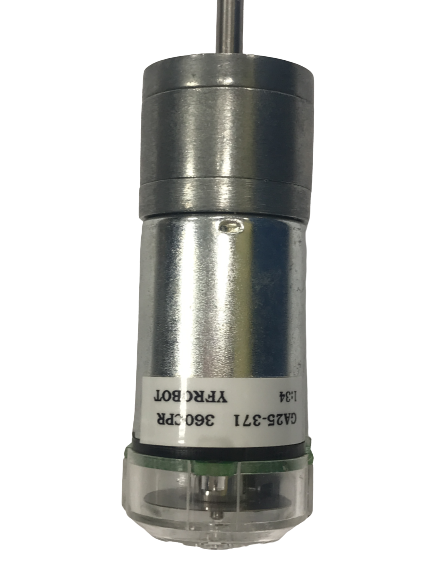
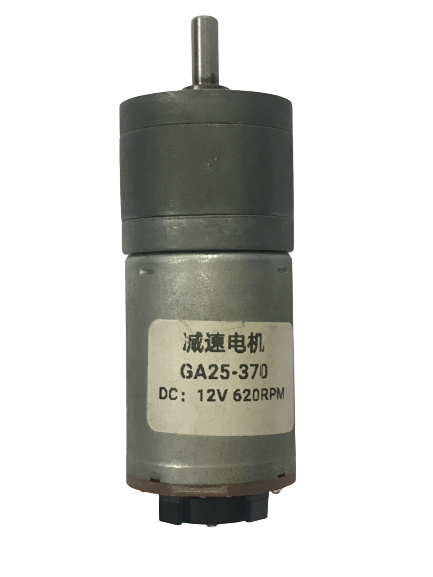
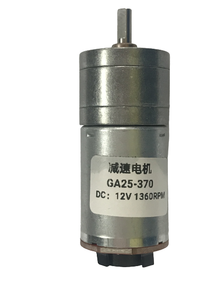
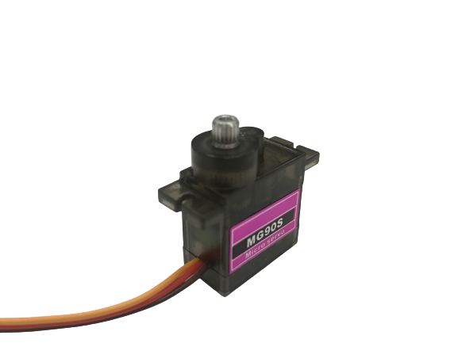
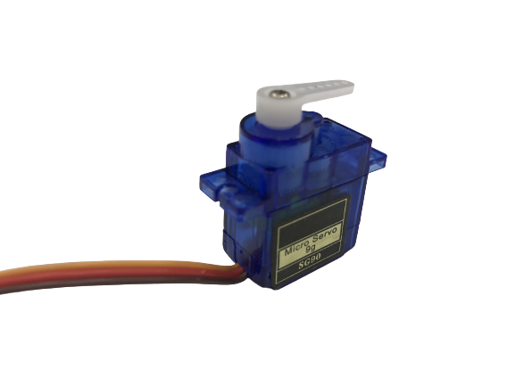

# 
</img>2023WRO Future Engineers Fire In Half 

## 
Motor Performance Parameters(馬達性能參數)

### Rear-wheel drive DC motor(後驅直流馬達)
- 我們在選擇直流馬達過程中，考慮了轉速，扭矩等因素，最後選擇了3種市售常見的直流馬達進行比較，分別為294RPM、620RPM和13600RPM，對應的扭矩分別為2.2Kg.cm、0.9Kg.cm和0.4Kg.cm。雖然1360RPM轉速的馬達是最快的，但它的扭矩過小，這可能導致機型無法正常驅動。另一方面，294RPM的速度太慢了，不符合我們的預期。
- 因此，我們決定選用620RPM的馬達作為我們的驅動馬達。這個選擇在速度和扭矩之間取得了平衡，能夠使我們的機型保持穩定且高效的運行。 

- During the selection process of a DC motor, factors such as rotational speed and torque were considered. Ultimately, we compared three commonly available DC motors: 294RPM, 620RPM, and 13600RPM, corresponding to torque values of 2.2Kg.cm, 0.9Kg.cm, and 0.4Kg.cm, respectively. While the 13600RPM motor offers the highest speed, its torque is insufficient, potentially impeding proper functionality. Conversely, the 294RPM motor is too slow, not meeting our expectations.
- Therefore, we have opted for the 620RPM motor as our driving motor. This choice strikes a balance between speed and torque, ensuring our model maintains stable and efficient operation.

|JGA25 371|JGA25 370 620|JGA25 370 1360|
| :----:|:---:|:----:|
||||
|轉速:294RPM|轉速:620RPM|轉速:1360RPM|
|扭矩:2.2Kg.cm|扭矩:0.9Kg.cm|扭矩:0.4Kg.cm|
|消耗功率:4.2W|消耗功率:3.6W|消耗功率:3.6W|

### Steering Mechanism Servo Motor(轉向機構伺服馬達)

- 在選擇轉向時的馬達(Servo Motor)時，我們仔細考慮了扭矩、精準度等因素，最終選擇了兩種Servo Motor進行比較，分別是MG90S和SG90。兩者最大的差別在於MG90S內部的齒輪是鐵製的，而SG90內部的齒輪則是塑膠製的。
- 經過測量後，兩者在尺寸和重量上都是相同的，然而由於MG90S內部齒輪採用鐵製，因此更為耐用。基於這個原因，我們決定選用MG90S作為我們機型轉向時的馬達。

- When choosing the servo motor for steering, we carefully considered factors such as torque and precision. Ultimately, we compared two servo motors, the MG90S and SG90. The main difference between the two is that the MG90S has metal gears inside, while the SG90 has plastic gears. 
- After measurements, both motors were found to have the same size and weight. However, due to the MG90S's metal gears, it is more durable. Based on this reason, we decided to select the MG90S as the servo motor for steering in our model.

|MG90S|SG90|
| :---:|:---:|
|||

# 
![HOME][Return Home](../../)
  
