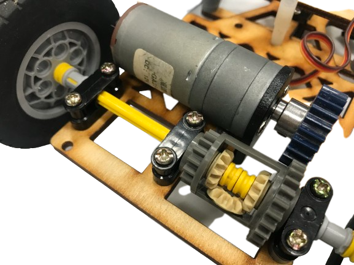
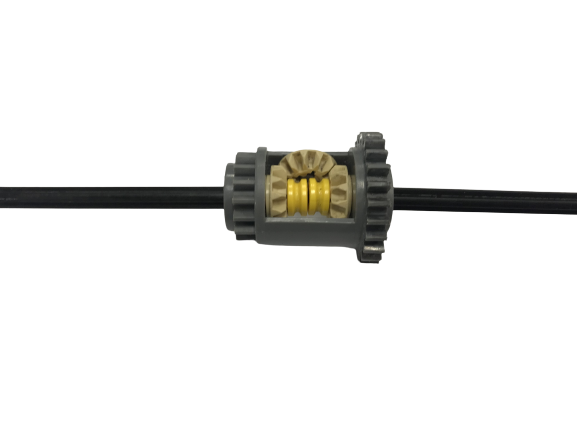

## 
Vehicle Chassis Design (汽車底盤設計)
 

##  Gear Differential (車輛底盤實體照)

<table>
 <tr align="center" >
  <th>車輛底盤(正面)</th>
  <th>車輛底盤(反面)</th>
 </tr>
 <tr align="center">
  <td> </td>
  <td> </td>
 </tr>
</table>

- 我們使用JGA25-370馬達結合LEGO的齒輪差速器，並將其連接到十字軸上，再將輪胎裝上十字軸，這樣我們的汽車就擁有了動力驅動。
- We use the JGA25-370 motor combined with LEGO's gear differential and connect it to the cross-axis. Then, we attach the wheels to the cross-axis, providing our car with power and propulsion.

 

##  Gear Differential (齒輪差速器)

    

__差速器的主要功能如下：__

1. 平衡動力：在直線行駛時，車輛的兩個輪胎通常需要獲得相同的動力，以保持車輪之間的平衡。差速器可以讓兩個輪胎在直行時保持相同的轉速，使得動力均勻分配，減少轉向時的滑動現象。  
2. 轉向功能：在車輛轉彎時，內側輪胎和外側輪胎需要旋轉不同的速度，因為內側輪胎行駛的距離比外側輪胎短。差速器允許兩個輪胎在轉彎時轉速不同，以實現平順的轉向動作。  
3. 當車輛行駛在不同的地面條件下，例如左右輪胎在不同摩擦係數的地面上，差速器可以根據需要在兩個輪胎之間分配不同的動力，以確保車輛的穩定性和控制性。  
__差速器通常由齒輪機構組成，它們允許輪胎之間有不同的轉速，並根據實際需要在左右輪胎之間進行動力分配__

__The main functions of a differential are as follows:__
1. Power Balancing: When a vehicle is driving in a straight line, both wheels usually need to receive the same amount of power to maintain balance between them. The differential allows both wheels to maintain the same rotational speed during straight-line driving, ensuring even power distribution and reducing skidding during turns.  
2. Steering Capability: When a vehicle is turning, the two wheels need to rotate at different speeds since the inner wheel travels a shorter distance than the outer wheel. The differential allows the two wheels to rotate at different speeds during turns, enabling smooth steering maneuvers.  
3. Adaptation to Different Terrains: When a vehicle is driving on different surfaces with varying friction coefficients, such as one wheel on a slippery surface and the other on a high-grip surface, the differential can allocate different amounts of power to each wheel as needed to ensure vehicle stability and control.  
__The differential is typically composed of a gear mechanism that allows the wheels to rotate at different speeds and distributes power between the left and right wheels as required.__

## Ackermann steering geometry(阿克曼轉向機構)

<table>
 <tr align="center" >
  <th>阿克曼機構(正面)</th>
  <th>阿克曼機構(反面)</th>
 </tr>
 <tr align="center">
  <td> </td>
  <td> </td>
 </tr>
</table>

阿克曼轉向（Ackermann Steering）是一種常見的轉向設計，用於提供四輪轎車或其他多輪車輛的順暢轉向和穩定性。這種轉向設計是根據一個幾何原理來實現，以確保內外側輪胎在轉彎時保持恰當的轉角，從而使車輛更容易轉向並減少輪胎的滑移。

阿克曼轉向的主要原理如下：

1. 定軸前輪：在阿克曼轉向中，前輪是定軸的，它們沒有偏轉能力，只能在直線上前進。這意味著前輪的轉向角度對所有轉彎是固定的。

2. 轉向鉸鏈：當車輛轉彎時，轉向鉸鏈連接著兩個前輪。這個轉向鉸鏈的設計確保內側輪胎和外側輪胎在轉彎時具有不同的轉角，以適應彎道半徑的變化。

3. 轉向角：內側輪胎需要更大的轉向角度，以更快地繞過彎道。外側輪胎的轉向角度相對較小，以保持穩定性並減少滑移。

阿克曼轉向的優點是它可以提供較小的轉彎半徑並改善轉向的穩定性。這對於緊湊空間中的轉彎和高速轉向非常重要。設計師必須確保轉向鉸鏈和其他相關組件的幾何形狀和長度是恰當的，以確保阿克曼轉向的正確功能。

Ackermann Steering is a common steering design used to provide smooth turning and stability for four-wheeled vehicles, including cars and other multi-wheeled vehicles. This steering design is based on a geometric principle that ensures the proper angles between the inner and outer wheels during turns, making the vehicle easier to steer and reducing tire slippage.

The main principles of Ackermann Steering are as follows:

1. Fixed-Axle Front Wheels: In Ackermann Steering, the front wheels are fixed on their axles and cannot steer independently. They can only move straight forward. This means the steering angle of the front wheels is fixed for all turns.

2. Steering Linkage: When the vehicle turns, a steering linkage connects the two front wheels. The design of this steering linkage ensures that the inner and outer wheels have different turning angles during turns to accommodate the varying radius of the curve.

3. Steering Angle: The inner wheel requires a larger steering angle to turn more sharply around the curve. The steering angle of the outer wheel is relatively smaller to maintain stability and reduce tire slip.

The advantages of Ackermann Steering are that it provides a smaller turning radius and improves steering stability. This is crucial for maneuvering in tight spaces and making high-speed turns. Designers must ensure that the geometry and lengths of the steering linkage and other related components are appropriate to achieve the correct functioning of Ackermann Steering.

# 
[Return Home](../../)
  
