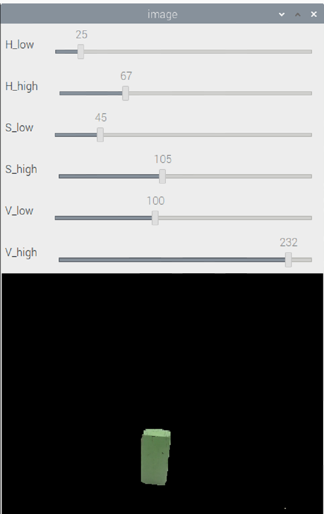
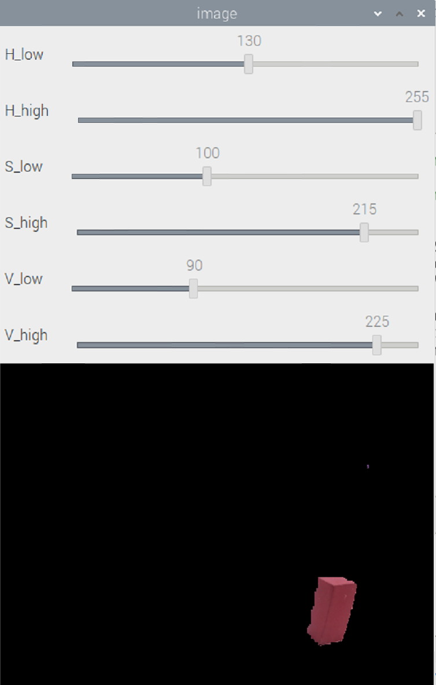
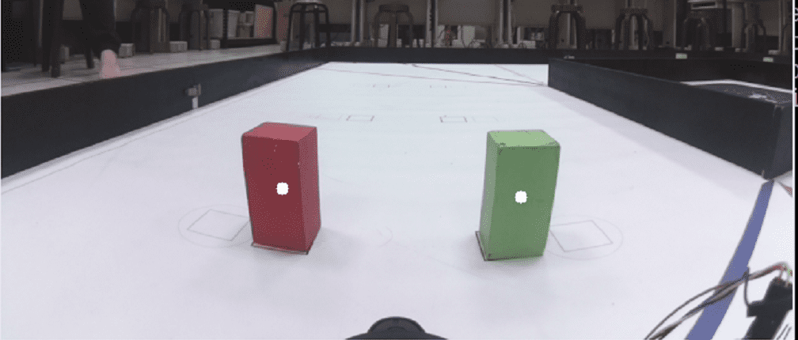

# <div align="center">Image Preprocessing(圖像預處理)</div> 

## 中文
我們在車輛系統中使用OpenCV library的影像處理功能建立了一個介面，用於調整HSV顏色範圍的上下限。這個介面根據不同的需求動態地調整過濾所需的HSV值。在影像處理過程中，我們使用`cv2.cvtColor`函數將原始圖像轉換成HSV（色相、飽和度、明度）色彩空間。我們將選取的HSV值`min_red`、`max_red`、`min_green`、`max_green`，進行相應的顏色過濾。使我們能夠檢測紅色和綠色的交通標誌。最後，以陣列方式儲存至record_file。這樣的紀錄功能可以幫助我們保存特定環境下的過濾參數，以便於以後的使用。

## English
In our vehicle system, we utilize the image processing capabilities of the OpenCV library to create an interface for adjusting the upper and lower limits of the HSV color range. This interface dynamically adjusts the HSV values required for filtering based on different needs. During the image processing, we use the cv2.cvtColor function to convert the original image into the HSV (Hue, Saturation, Value) color space.We apply the selected HSV values, min_red, max_red, min_green, and max_green, to perform color filtering, enabling us to detect red and green traffic signs. Finally, the filtered HSV values are stored in an array format in the record_file. This recording functionality helps us preserve the filtering parameters for specific environments, facilitating future use.

<div align="center">
  
|Adjusting Green Traffic Sign HSV Value Range(調整綠色交通標誌HSV數值範圍)|Adjusting Red Traffic Sign HSV Value Range(調整紅色交通標誌HSV數值範圍)|
|:----:|:----:|
| |  | 


|Traffic Sign Image Recognition(影像辨識交通標誌)|
|:----:|
|<div align="center"></div>|

</div>

### The values stored after HSV filtering(HSV過濾後儲存的數值)
```python
min_green = [25, 45, 100]
max_green = [67, 105, 232]
min_red = [130, 100, 90]
max_red = [255, 215, 225]
```

# <div align="center">[Return Home](../../)</div>  
