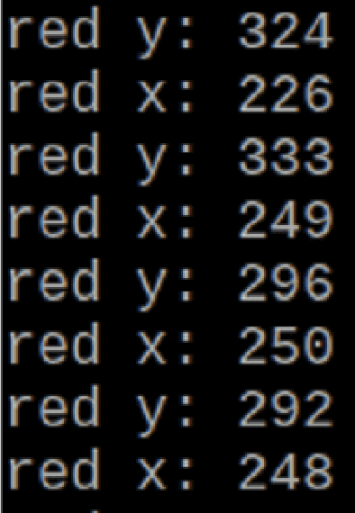
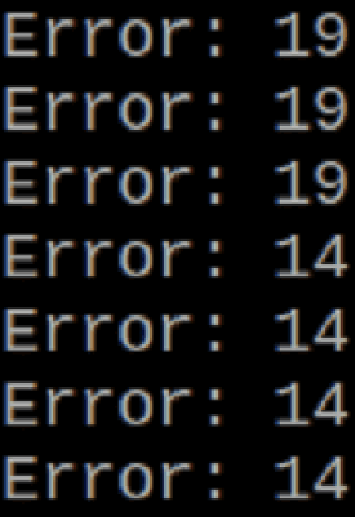

## <div align="center">Pillar Steering(支柱轉向)</div> 

### 中文

透過過濾後的紅、綠色圖像以及OpenCV library中的影像處理功能，當車輛靠近交通標誌時，我們持續從圖像中運用`cv2.boundingRect`擷取交通標誌位置的x，y座標資訊。將這些座標值與預設數值進行比較，我們可以得知交通標誌的位置是否偏離預期。若存在誤差，我們將根據誤差的大小和方向，計算伺服馬達需要調整的角度。這樣的控制使得車輛能夠在行駛過程中即時響應交通標誌的位置變化，自動調整行駛方向以確保行駛的穩定性和準確性。

### English

Through the filtered red and green images and the image processing capabilities of the OpenCV library, as the vehicle approaches a traffic sign, we continuously use `cv2.boundingRect` to extract the x and y coordinate information of the traffic sign's position from the image. By comparing these coordinates with the default values, we can determine if the traffic sign's position deviates from the expected location. If there is an error, we calculate the angle adjustment needed for the servo motor based on the magnitude and direction of the error. This control allows the vehicle to respond to changes in the traffic sign's position in real-time during its motion, automatically adjusting its direction to ensure stability and accuracy in its trajectory.

#### Read x and y coordinates(讀取x、y座標)
```python
mask = cv2.inRange(image, min_red, max_red)  
contours, hierarchy = cv2.findContours(mask, cv2.RETR_TREE, cv2.CHAIN_APPROX_SIMPLE)
for pic, contour in enumerate(contours):
    x, y = cv2.boundingRect(contour)
```

<div align="center">

|Traffic sign coordinates(交通標誌座標)|Error value(誤差值)|
|:----:|:----:|
|<div align="center">|<div align="center">|
</div>

# <div align="center">[Return Home](../../)</div>  
