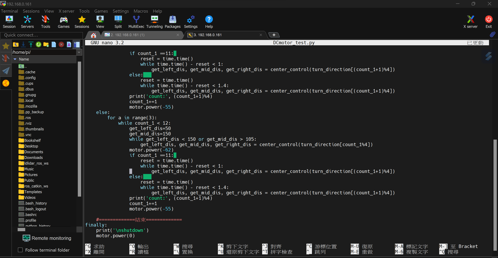
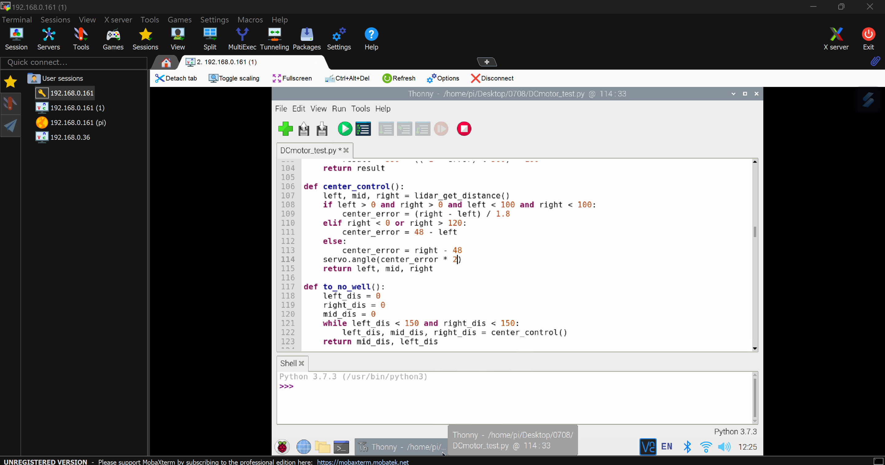

## <div align="center">Obstacle Challenge Program Explanation(障礙賽程式說明)</div> 

### Obstacle Challenge Flowchart(任務賽程式流程圖)


#### 中文
- 在競賽中，車輛在行進時需要進行對立柱顏色的影像辨識，以實施避障策略。為實現這一目標，我們利用樹莓派支援的鏡頭模組，進行影像辨識功能的開發。同時，我們也使用樹莓派來控制馬達，以及進行光達距離的偵測。所有這些功能都是透過Python語言來實現的，這使得控制過程更加便捷。  
- 我們可以運用MobaXterm工具中的SSH或VNC功能，連線至樹莓派，以Python撰寫車輛控制程式。 
- 此次競賽所需的程式模組如下：time 、pickle、pigpio、smbus、struct、os、math、cv2、threading、numpy、sys、rospy、LaserScan、signal 

#### English
- In the competition, the vehicle needs to perform color image recognition of opposing pillars while moving to implement obstacle avoidance strategies. To achieve this goal, we utilize the Raspberry Pi's supported camera module to develop the image recognition functionality. Simultaneously, we also use the Raspberry Pi to control the motors and perform LiDAR distance detection. All of these functionalities are implemented using the Python language, which makes the control process more convenient.  
- We can utilize the SSH or VNC functionality within the MobaXterm tool to connect to the Raspberry Pi and write vehicle control programs using Python.  
- The required software modules for this competition are as follows: time 、pickle、pigpio、smbus、struct、os、math、cv2、threading、numpy、sys、rospy、LaserScan、signal 


<div align="center">
<table>
  <tr>
    <th>以MobaXterm中SSH編輯程式</th><th>以MobaXterm中VNC編輯程式</th>
  </tr><tr>
    <td></td>
    <td></td>
  <tr>
  </tr>
</table>
</div>

### Explanation of Pseudo code Features.(偽程式特色說明)

#### Traffic sign recognition using image processing(影像辨識交通標誌)

#### 中文
- 我們採用的積木辨識方式是透過 OpenCV 將影像轉換成 HSV 色彩空間。這樣的處理方式使我們能夠在不同環境下輕鬆辨識出積木。
- 由於 HSV 色彩空間對於光照和環境變化的影響相對較小，因此我們能夠更穩定地識別出積木的顏色特徵，並即時做出適應性的反應。這使我們的車輛能夠在各種場景中順利辨識並避開積木

#### English
- We adopted a block recognition method using OpenCV to convert the image into the HSV color space. This processing approach allows us to easily recognize blocks in various environments.
- The HSV color space is less affected by lighting and environmental changes, enabling us to more stably identify the color features of the blocks and respond adaptively in real-time. This capability allows our vehicle to successfully recognize and avoid blocks in various scenarios.

- Program code(程式碼):
```
# 將原始圖像轉換成HSV色彩空間
hsv_image = cv2.cvtColor(img, cv2.COLOR_BGR2HSV)

# 透過紀錄的HSV過濾數值創建一個mask遮罩影像
mask = cv2.inRange(hsv_img, lower, upper)

# 在mask遮罩上尋找所有的輪廓，並將輪廓資訊儲存在contours和hierarchy中。
contours, hierarchy = cv2.findContours(mask, cv2.RETR_TREE, cv2.CHAIN_APPROX_SIMPLE)

# 使用for迴圈遍歷contours列表中的每個輪廓
for pic, contour in enumerate(contours):

    # 使用cv2.contourArea函式計算輪廓的面積，並記錄在area變數中
    area = cv2.contourArea(contour)

    # 使用cv2.boundingRect函式獲取輪廓的外接矩形的左上角x、y座標以及寬和高，並記錄在變數中
    x, y, w, h = cv2.boundingRect(contour)

    # 計算輪廓的中心點x、y
    x = int(x + w / 2)
    y = int(y + h / 2)

    # 判斷該輪廓的中心點y座標和面積是否大於預先設定的數值
    if y > max_y and area > block_detect_min_area:
        find_area = area
        max_y = y
        find_x = x
        find_y = y

# 使用cv2.circle函式繪製出輪廓的中心點
cv2.circle(raw_img, (find_x, find_y), 5, (255, 255, 255), -1)

# 回傳繪製完的影像、該輪廓的x、y座標和面積
return raw_img, find_x, find_y, find_area
```

### [record_file](./record_file)

#### 中文
record_file這個資料夾裡存取了從detect_HSV.py中辨識紅綠交通標誌的HSV範圍數值和record_venuelinevalue.py中顏色感測器測量完的藍、橘色線的數值。

#### English
The folder "record_file" contains the HSV range values obtained from the recognition of red and green traffic signs in detect_HSV.py, as well as the values measured from the blue and orange lines using the color sensor in record_venuelinevalue.py.

### [detect_HSV.py](./detect_HSV.py)

#### 中文
這個程式碼透過一個界面利用軌道條來調整HSV色彩範圍，進而識別影像中的紅綠交通標誌，之後將不同的HSV範圍透過record_HSVGreen.p和record_HSVRed.p保存到record_file資料夾中供後續使用。

#### English
This code uses a user interface with trackbars to adjust the HSV color ranges and thereby identify red and green traffic signs in the image. Subsequently, it saves the different HSV ranges as record_HSVGreen.p and record_HSVRed.p files in the save_file folder for later use.

### [record_venuelinevalue.py](./record_venuelinevalue.py)

#### 中文
這段程式碼是一個使用顏色感測器讀取到藍、橘色線數值並將結果透過record_linevalue.p儲存到record_file資料夾中。

#### English
This code is a script that uses a color sensor to read the values of blue and orange lines and then stores the results in a file named "record_linevalue.p" in the "record_file" folder.

## [Self_Driving_Car_Function.py](./Self_Driving_Car_Function.py)

#### 中文
這個程式碼是一個函式，透過使用樹梅派(raspberry pi)搭配各種感測器以及鏡頭，達到透過影像處理與控制系統能夠辨識紅綠交通標誌，讀取顏感數值，並能夠控制直流馬達轉速與轉向以及伺服馬達轉向角度。

#### English
This code is a function that utilizes a Raspberry Pi along with various sensors and a camera to achieve the capability of recognizing red and green traffic signs through image processing and control systems. Additionally, it can read color sensor values and control the speed and direction of DC motors as well as the steering angle of servo motors.

### [Obstacle_Challenge.py](./Obstacle_Challenge.py)

#### 中文
這段程式碼是一個使用多種感測器和模組控制車輛的Python腳本，包括OpenCV、ROS（機器人作業系統）、直流馬達、伺服馬達和顏色感測器，並利用這些功能使車輛能閃避交通標誌完成任務。

#### English
This code is a Python script that controls the vehicle using multiple sensors and modules, including OpenCV, ROS (Robot Operating System), DC motors, servo motors, and a color sensor. It utilizes these functionalities to enable the vehicle to avoid traffic signs and complete its mission.

# <div align="center">[Return Home](../../../)</div>  
