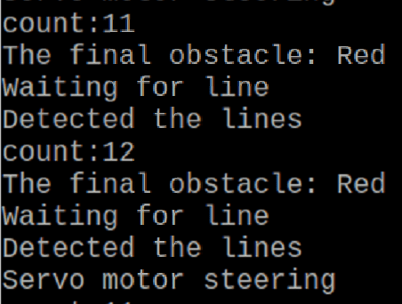

## <div align="center">Slalom Steering(迴轉轉向)</div> 

### 中文
當顏色感測器偵測到的線條數量小於預設數值時，鏡頭模組會持續讀取經過的交通標誌顏色，直到線條數量大於預設數值為止。此時，會判斷最後的交通標誌是否為紅色。如果是紅色，就會設定伺服馬達的角度，使車輛轉向指定方向，完成反方向的第三圈。如果最後的交通標誌不是紅色，則車輛會繼續完成正向的第三圈。

### English
When the color sensor detects a number of lines less than the preset value, the camera module will keep reading the colors of the passing traffic signs until the number of lines exceeds the preset value. At this point, the system will determine if the last traffic sign is red. If it is red, the system will set the servo motor angle to make the vehicle turn in the specified direction to complete the third lap in the opposite direction. If the last traffic sign is not red, the vehicle will continue to complete the third lap in the forward direction.

#### Setting the servo motor angle(設定伺服馬達角度)
```python
if final_obstacle == 'red':
  servo.angle(-95)
```

<div align="center">

|Read the number of lines and record the color of the traffic sign(讀取線條數量與紀錄交通標誌顏色)|
|:----:|
|<div align="center">|
</div>

# <div align="center">[Return Home](../../)</div>  
