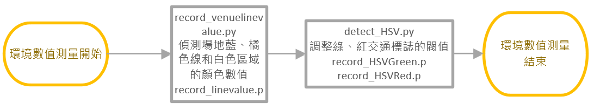

## <div align="center">Software Platform (軟體平台)</div> 

- ## System platform software installation(系統平台軟體安裝)
**系統所需軟體，均使用MobaXterm（一種遠端計算機管理工具）中的VNC或SSH功能，進行與樹莓派的連線。透過這些連線，可以進行ROS、OpenCV的安裝，以及系統的更新與設定工作。** 

**The required software for the system utilizes the VNC or SSH functionality within MobaXterm, a remote computer management tool, to establish connections with the Raspberry Pi. Through these connections, tasks such as installing ROS and OpenCV, as well as performing system updates and configurations, can be accomplished.**

<div align="center">
<table>
  <tr>
    <th>使用SSH連線樹莓派</th><th>使用VNC連線樹莓派</th>
  </tr><tr>
    <td></td>
    <td></td>
  <tr>
  </tr>
</table>
</div>


### 中文

安裝PI OS
- 選擇Raspberry Pi OS (Legacy)版本
- 為了確保不會有版本不相容的問題，須更新作業系統
```
$ sudo apt-get update
$ sudo apt-get full-upgrade
```

輸入指令到配置工具:
```
$ sudo raspi-config
```
- 選擇Interface Options以啟用VNC、SSH、Camera、I2C等功能。
- 安裝OpenCV 4.7.0.72版本：降低setuptools版本以確保與所選OpenCV版本的相容性。
- 安裝pigpio library：便於控制直流馬達的方向和轉速調整。
- 安裝ROS（機器人作業系統）版本：ROS1 Noetic：配置ROS資料庫。建立工作空間，安裝相依項目，並建置catkin環境。
- 安裝D100 Lidar驅動程式：取得D100 Lidar安裝包。配置USB接口權限。安裝所需的相依項目並編譯驅動程式。新增Lidar所需的環境變數。

### English

System Platform Software Installation Process Diagram:

Install Raspberry Pi OS:
- Select the Raspberry Pi OS (Legacy) version.
- Ensure compatibility by updating the operating system:
```python
$ sudo apt-get update
$ sudo apt-get full-upgrade

```
Configure the Raspberry Pi using raspi-config:
```python
$ sudo raspi-config
```
- Select "Interface Options" to enable VNC, SSH, Camera, I2C, and other functions.
- Install OpenCV version 4.7.0.72:Downgrade setuptools to ensure compatibility with the selected OpenCV version.
- Install the pigpio library:This will facilitate the control of the DC motors for direction and speed adjustments.
- Install ROS (Robot Operating System) version: ROS1 Noetic:Configure ROS repository.Set up the workspace, install dependencies, and build the catkin environment.
- Install D100 Lidar Driver:
Obtain the D100 Lidar installation package.
Configure USB interface permissions.
Install required dependencies and compile the driver.
Add necessary environment variables for the Lidar.

<div align="center">
  
|System Installation Process Flowchart(架設系統環境流程圖)|
|:----:|
||
  
</div>

- ## Record Environment Values(紀錄場地環境數值)

### 使用[record_venuelinevalue.py](../../src/Programming/Open_Challenge/record_venuelinevalue.py)檔案紀錄場地各種顏色數值

#### 中文
- 按下按鈕後，程式將開始讀取橘色線條的數值並記錄最低值，再按一次按鈕，這個數值將被保存到名為"record_linevalue.p"的文件中。之後，再次按下按鈕，程式會開始讀取藍色線條的數值並記錄其最低值，再按一次按鈕，這個數值也會被保存到"record_linevalue.p"文件中。最後，再次按下按鈕，程式將開始讀取白色區域的數值並記錄其最低值，再按一次按鈕，這個數值同樣會被保存到"record_linevalue.p"文件中。

#### English
- After pressing the button, the program will start reading the values of the orange lines and record the minimum value. Pressing the button again will save this value to a file named "record_linevalue.p." Subsequently, pressing the button once more will initiate the reading of the blue lines' values and record their minimum value. Pressing the button again will save this new value to the same "record_linevalue.p" file.
Finally, pressing the button once more will trigger the program to read the values of the white area and record its minimum value. Pressing the button again will, once again, save this new value to the "record_linevalue.p" file.This process allows for the recording and storage of the minimum values of the orange lines, blue lines, and white area as the button is pressed multiple times.

<div align="center">

|Recorded Color Sensor Values(顏感紀錄的數值)|
|:----:|
||

</div>

### 使用[detect_HSV.py](../../src/Programming/Open_Challenge/detect_HSV.py)檔案調整交通標誌閥值

#### 中文
- 開啟detect_HSV.py後，會顯示數字1~5的功能:   
數字1:將數值調整到上次所記錄的紅色閥值。  
數字2:將目前的紅色閥值記錄到record_HSVRed.py文件中。  
數字3:將所有閥值調整成預設數值。  
數字4:將數值調整到上次所記錄的綠色閥值。  
數字5:將目前的綠色閥值記錄到record_HSVGreen.py文件中。  

#### English
- Upon opening detect_HSV.py, the program will display functionalities numbered from 1 to 5:  
Number 1: Adjust the values to the last recorded red threshold value.  
Number 2: Record the current red threshold values to the record_HSVRed.py file.  
Number 3: Adjust all values to the default settings.    
Number 4: Adjust the values to the last recorded green threshold value.  
Number 5: Record the current green threshold values to the record_HSVGreen.py file.  

<div align="center">

|Display the numeric keys functionality(顯示鍵盤數字功能)|
|:----:|
||

|HSV Filtering for Red Traffic Signs(HSV過濾紅色交通標誌)|HSV Filtering for Green Traffic Signs(HSV過濾綠色交通標誌)|
|:----:|:----:|
|||

</div>

<div align="center">
  
|Environmental Measurement Process Diagram(環境數值測量流程圖)|
|:----:|
||
  
</div>
 

# <div align="center">[Return Home](../../)</div>  
