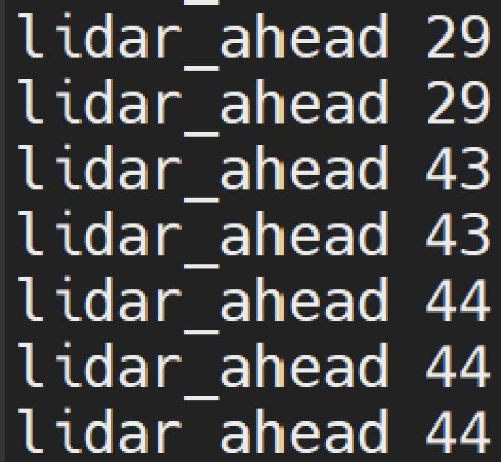
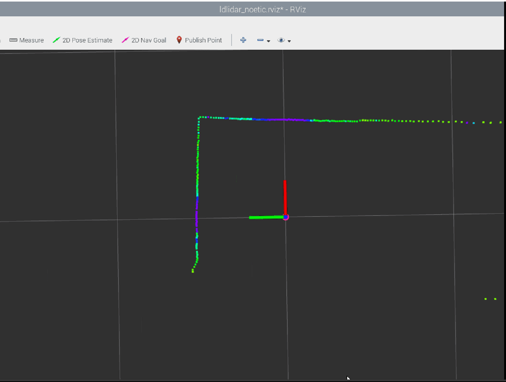

## 
Wall Steering(壁面轉向)
 

### 中文

我們使用D100 Lidar透過串口與樹莓派進行通信，並借助[ROS (機器人作業系統)](../../other/ROS/README.md) 的訂閱功能，實現了對光達數據的讀取。我們利用讀取的光達數值，進行判斷，以確定是否車輛靠近邊牆。這是通過將讀取到的光達數值與我們預先設定的閾值進行比較來實現的。若光達數值小於預先設定的閾值，則我們可以確定車輛遭遇邊牆，否則則表示車輛前方是可行駛的路徑。

### English

We use the D100 Lidar to communicate with the Raspberry Pi through the serial port and utilize the [ROS (Robot Operating System)](../../other/ROS/README.md) subscription functionality to read the Lidar data. By reading the Lidar values, we make a judgment to determine if the vehicle is close to a side wall. This is achieved by comparing the read Lidar values with a pre-set threshold. If the Lidar value is below the pre-set threshold, we can confirm that the vehicle has encountered a side wall. Otherwise, it indicates that there is a drivable path ahead of the vehicle.

|Read Lidar Values(讀取光達數值)|Lidar Display(光達畫面)|
|:----:|:----:|
|||

# 
[Return Home](../../)
  
