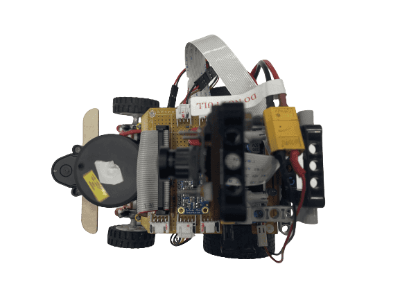
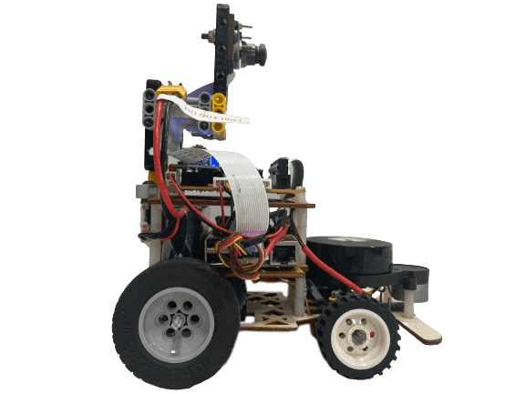
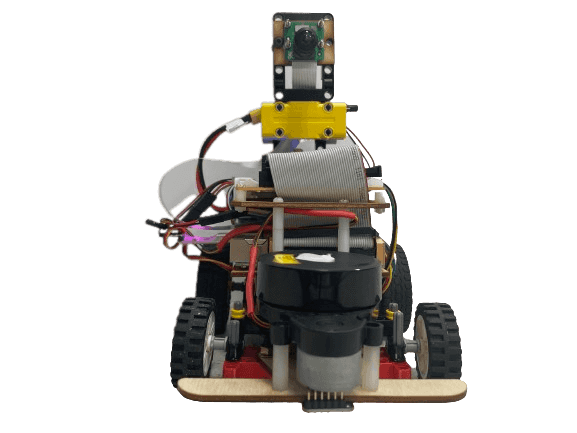

# 
Vehicle's photos(自駕車各視角圖)
 

|  |    |  |
| :-----|:--- |:------- |
|Top View(上視圖)|Right View(右視圖)|Front View(前視圖)|
|  |    |  |
|Bottom View(下視圖)|Left View(左視圖)|Rear View(後視圖)|

# 
[Return Home](../)
  
